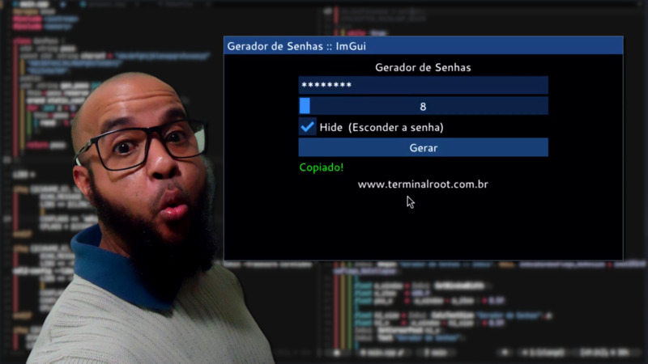

# genpass
Um Gerador de Senhas alfanumérica com C++, Dear ImGui, SDL2 e com contexto OpenGL

---

# Compilando e rodando o projeto na sua máquina
> Lembre-se de instalar antes as dependências citadas [nesse artigo](https://terminalroot.com.br/2024/03/como-compilar-projetos-com-opengl-sdl2-e-dear-imgui.html)

```bash
git clone https://github.com/terroo/genpass --recurse-submodules
cd genpass
make
./a.out
```

# Listar todas as branchs:
```bash
git branch -a
```
> `git checkout copyx11 # Mesma versão da 'main', com a rotina de copiar para X11`

Alterar pra a branch **SEM a rotina de COPIAR para X11**:
```bash
git checkout nocopy
```

---

# Clonar SOMENTE a branch `nocopy` SEM a rotina de COPIAR do X11
```bash
git clone --branch nocopy --single-branch https://github.com/terroo/genpass
```

---

# Projeto feito no vídeo: <https://youtu.be/Wru7t8djnto>
 

---

# Versão WEB
Disponível no endereço:
### <https://pluscpp.github.io/imgui/>


